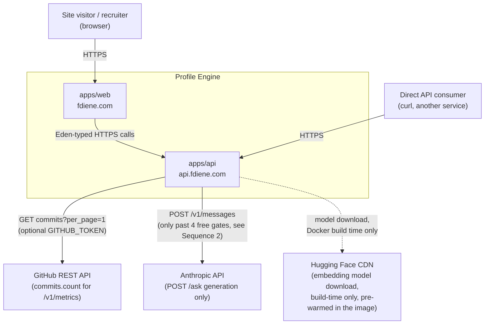
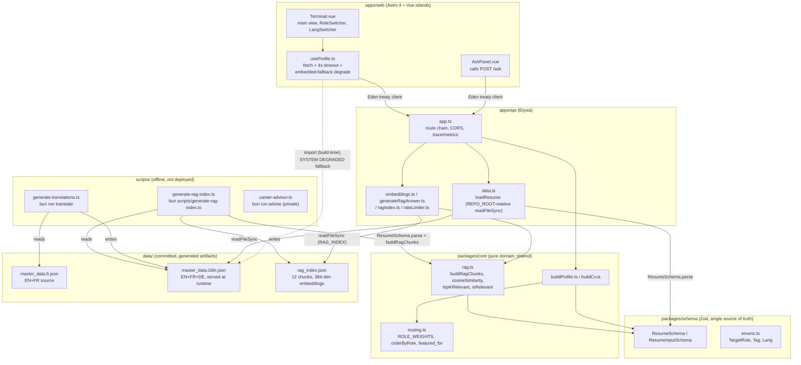
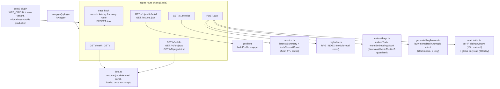
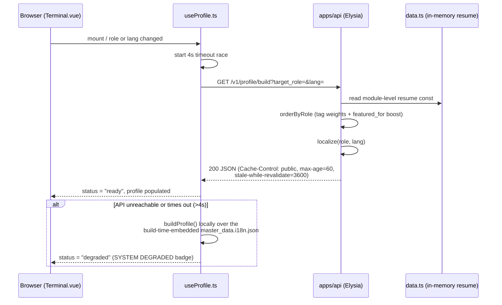
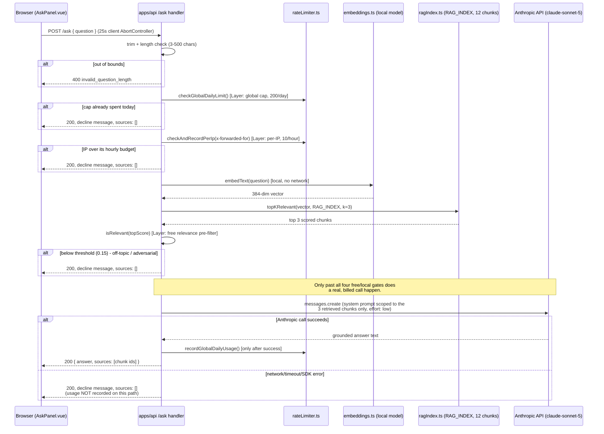
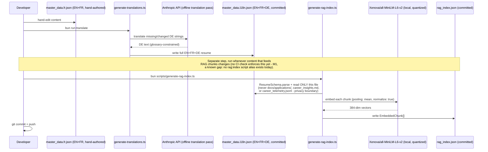
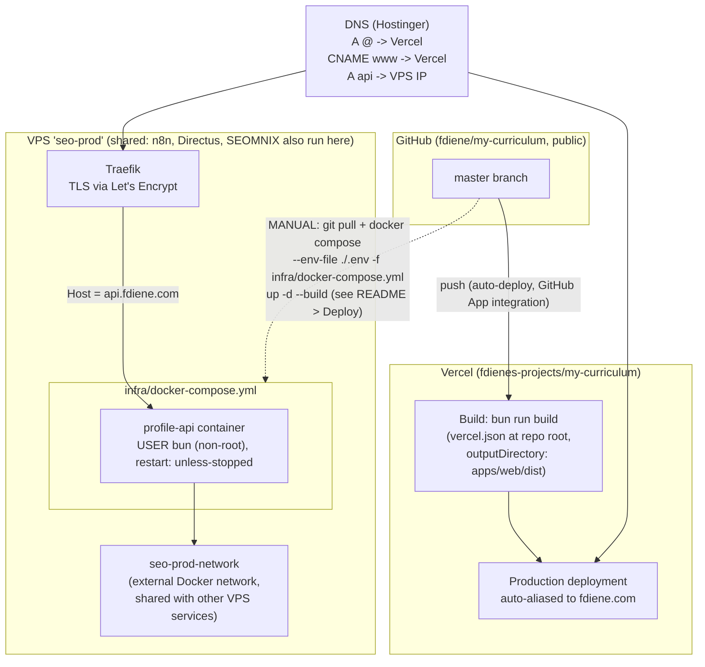

# Profile Engine - Architecture

> Maintained reference doc. Update this alongside any change that touches a route,
> a deployment target, or the offline content pipeline. Diagrams are Mermaid -
> GitHub renders them natively in this file, no external tooling required.

## Overview

Profile Engine is the system behind [fdiene.com](https://fdiene.com): a résumé served as
a typed API rather than a static PDF. A Bun + Turborepo monorepo with Zod schemas as the
single source of truth, an Elysia API, and an Astro/Vue frontend that reorders its own
content per audience (`?role=&lang=`).

Almost the entire system is offline-generated and read-only at runtime: content is
authored once, translated and embedded by offline scripts, committed to git, and served
from memory. The one runtime exception is `POST /ask` - a retrieval-augmented endpoint
that answers real questions about the résumé using a live (rate-limited, cost-capped)
Claude call. That exception is deliberate and documented, not an oversight.

---

## 1. System Context

Who and what talks to Profile Engine, and why.

**Non défini / out of scope for this diagram:** no user accounts, no database, no
payment or write path anywhere in the system - everything a visitor sees is a read of
data authored offline.

---

## 2. Containers

The real shape of the monorepo and how the pieces depend on each other.

---

## 3. Components - `apps/api`

The one non-trivial container, broken down.

---

## 4. Sequence: normal profile request

The common case - no LLM involved, sub-millisecond on the API side.

---

## 5. Sequence: `POST /ask` (the one runtime LLM exception)

Every step before the Claude call is free or already-computed. The paid call is the last
possible thing that can happen, gated behind four checks.

**Layer 5** (not visible in this sequence - it lives outside the code): an account-level
spending limit set manually on the Anthropic console for the deployed API key, as the
backstop that holds even if a bug exists in every layer above.

---

## 6. Sequence: offline content pipeline

Runs on a developer machine, never in production. Nothing here executes at request time.

---

## 7. Deployment

Two independent deploy paths - the web app auto-deploys, the API does not (deliberate,
see below).

**Why the API isn't auto-deployed:** it lives on a shared VPS alongside other production
services (n8n, Directus, SEOMNIX). A manual deploy step gives a human checkpoint before
touching shared infrastructure - revisit only if that friction becomes a real problem.

**Required environment variables at each layer** - see `README.md` > Environment
variables for the full table; the two `/ask`-specific deployment prerequisites
(`ANTHROPIC_API_KEY` on the VPS, and a spending limit set on the Anthropic console) are
called out separately in `README.md` > Deploy.

---

## 8. Key constraints and where they're recorded

This file is the map; the following are the primary sources of truth for *why*, kept
separately so this document doesn't drift into duplicating them:

- **The RAG feature's full design rationale** (why local embeddings over a hosted API,
  the exact cost-control layer ordering, what was explicitly ruled out and why):
  `docs/superpowers/specs/2026-08-25-rag-ask-endpoint-design.md`.
- **Environment variables, deploy commands, the `--env-file` vs `--project-directory`
  gotcha:** `README.md`.
- **Data model / schema:** `packages/schema/src/` is the single source of truth; this
  document describes shape and flow, not field-by-field detail.

## 9. Known gaps (honest, not fixed here)

- No CI check that `data/rag_index.json` is in sync with `data/master_data.i18n.json` -
  editing content and forgetting to re-run the indexer goes undetected (tracked, not
  yet fixed).
- No `bun run rag:index` alias exists yet; the indexer is invoked by its full path.
- `cosineSimilarity` (`packages/core/src/rag.ts`) has no zero-vector guard - fails safe
  (routes to the decline path) but the guard itself doesn't exist.
